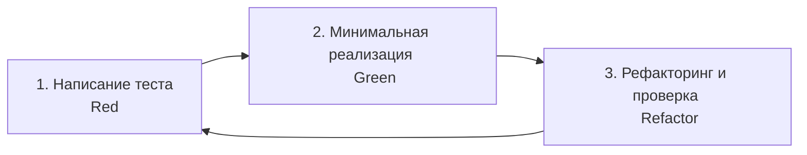

# Руководство для автономных ИИ-агентов и разработчиков (UniTalent)

> **Стандарты архитектуры, соглашения об именовании, правила рефакторинга, работа с БД и протоколы разработки для ИИ-агентов и инженеров в репозитории UniTalent.**

---

## 1. Архитектурные принципы

### 1.1. Server-First & Next.js App Router
1. **Серверные компоненты по умолчанию (RSC):** Каждый компонент в `src/app/` и `src/components/` является серверным, если ему явно не требуется хуки React (`useState`, `useEffect`, `useCallback`), браузерные API или обработчики событий (`onClick`, `onChange`).
2. **Изоляция клиентского кода:** Директива `"use client"` выносится как можно ниже по дереву компонентов (в конкретную кнопку, интерактивный инпут или модальное окно), чтобы не раздувать клиентский JavaScript-бандл.
3. **Единый источник валидации (Zod):** Все входные данные (формы на клиенте, параметры маршрутов, аргументы Server Actions) валидируются едиными Zod-схемами из `src/lib/validations/`.

### 1.2. Слоистая структура кода
Кодовая база разделена на четкие слои ответственности:
* `src/components/ui/` — тупые (dumb/presentational) примитивы дизайна (кнопки, бейджи, инпуты) без бизнес-логики.
* `src/components/<domain>/` — составные доменные компоненты (карточка резюме, kanban-колонка).
* `src/lib/validations/` — Zod-схемы валидации и выведенные типы TypeScript (`z.infer<typeof ...>`).
* `src/server/actions/` — серверные действия Next.js (Server Actions), отвечающие за авторизацию вызова, парсинг Zod и вызов сервисного слоя.
* `src/server/services/` — чистая бизнес-логика и доступ к данным через Prisma ORM. Не зависит от контекста HTTP/Next.js (удобно тестировать).
* `src/lib/db/` — синглтон Prisma Client.

---

## 2. Соглашения об именовании (Naming Conventions)

| Сущность | Стиль именования | Пример |
| :--- | :--- | :--- |
| **Файлы и папки** | `kebab-case` | `student-profile-form.tsx`, `academic-service.ts` |
| **React-компоненты** | `PascalCase` | `StudentProfileCard`, `KanbanColumn` |
| **Хуки React** | `camelCase` с префиксом `use` | `useApplicationFilters`, `useStudentProfile` |
| **Функции и утилиты** | `camelCase` | `normalizeGpaScore()`, `formatSalaryRange()` |
| **TypeScript интерфейсы/типы** | `PascalCase` | `StudentProfileDTO`, `CreateJobPostingInput` |
| **Перечисления (Enums)** | `UPPER_SNAKE_CASE` или `PascalCase` | `Role.STUDENT`, `ApplicationStatus.TEST_TASK` |
| **Prisma модели** | `PascalCase` (в единственном числе) | `model StudentProfile`, `model JobPosting` |
| **Поля Prisma** | `camelCase` | `graduationYear`, `currentCourse` |
| **Таблицы и колонки в PostgreSQL** | `snake_case` (через `@map` / `@@map`) | `@@map("student_profiles")`, `@map("created_at")` |

---

## 3. Правила работы с базой данных (Prisma ORM)

1. **Запрет на прямое редактирование SQL:** Любые изменения схемы выполняются исключительно через файл `prisma/schema.prisma`.
2. **Миграции через CLI:** Каждое изменение структуры схемы должно сопровождаться миграцией с осмысленным именем:
   ```bash
   npx prisma migrate dev --name add_academic_gpa_scale
   ```
3. **Транзакционность мутаций:** Все связанные операции (например, смена статуса отклика + запись в `ApplicationStatusHistory`) **обязаны** выполняться внутри `prisma.$transaction([ ... ])` или интерактивной транзакции `prisma.$transaction(async (tx) => { ... })`.
4. **Безопасность запросов:**
   * Запрещено использование неэкранированного сырого SQL (`$queryRawUnsafe`).
   * В запросах `findMany` всегда использовать пагинацию (`take`, `skip` или cursor-based) для списков откликов и вакансий.
   * При выборке профилей ограничивать возвращаемые поля (`select`), исключая чувствительные данные (`passwordHash`, внутренние токены).

---

## 4. Протокол разработки по TDD (Test-Driven Development)

При реализации любой новой функции ИИ-агент обязан строго следовать циклу TDD:



### Правила тестирования:
1. **Красный этап (Red):** Сначала создается файл теста в `tests/unit/` или `tests/integration/` с описанием ожидаемого поведения (валидация GPA, переход статусов отклика, права доступа к вакансии). Тест должен запускаться и падать с ожидаемой причиной.
2. **Зеленый этап (Green):** Пишется минимально необходимый код в схеме/сервисе/экшене, чтобы тест прошел успешно.
3. **Рефакторинг (Refactor):** Оптимизация кода, извлечение вспомогательных функций, типизация без нарушения контрактов тестов.
4. **Тестирование прав (Security Testing):** Обязательные тесты на попытку студента изменить статус чужого отклика или создать вакансию (проверка генерации ошибки `FORBIDDEN` / `UNAUTHORIZED`).

---

## 5. Формат ответов Server Actions и обработка ошибок

Каждое серверное действие (Server Action) должно возвращать строго типизированный ответ:

```typescript
export type ActionResponse<T> =
  | {
      success: true;
      data: T;
      message?: string;
    }
  | {
      success: false;
      error: string;
      fieldErrors?: Record<string, string[]>;
    };
```

* Ошибки бизнес-логики (например, «GPA должен быть в диапазоне от 1.0 до 5.0») возвращаются с кодом ошибки и понятным пользователю сообщением на русском языке.
* Внутренние непредвиденные исключения логируются на сервере с сохранением stack trace, но клиенту отдается обобщенное безопасное сообщение: `"Произошла непредвиденная ошибка на сервере. Пожалуйста, попробуйте позже."`.

---

## 6. Безопасность и проверка прав доступа (RBAC)

1. **Двойная проверка доступа:**
   * **Слой 1 (Middleware):** Проверка маршрутов в `middleware.ts` по роли пользователя из JWT-токена (`/student/*` доступен только `STUDENT`, `/employer/*` — `EMPLOYER`).
   * **Слой 2 (Action/Service level):** Повторная проверка `userId` и роли внутри каждого Server Action непосредственно перед выполнением операции с БД (защита от IDOR — Insecure Direct Object References).
2. **Студент не может редактировать чужой профиль:** Любая мутация данных студента проверяет, что `session.user.id === targetProfile.userId`.
3. **Работодатель видит только отклики на свои вакансии:** Запрос списка откликов обязательно фильтруется по `jobPosting.companyProfile.userId === session.user.id`.

---

## 7. Поддержание документации в актуальном состоянии

Если в процессе решения задачи агент:
* Меняет структуру схемы данных (`prisma/schema.prisma`) — он **обязан** обновить ERD в `docs/context.md`.
* Добавляет новые переменные окружения — обновить `.env.example` и таблицу в `docs/README.md`.
* Принимает важное архитектурное решение (библиотека, паттерн взаимодействия) — создать новый файл `docs/adr/ADR-XXX-<name>.md`.
