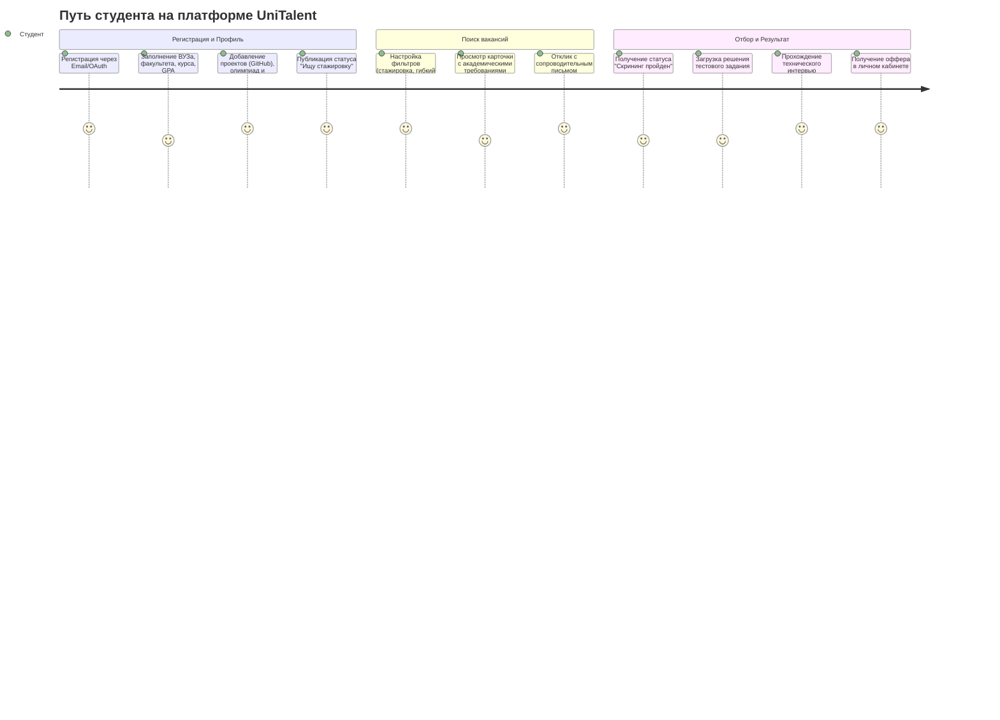
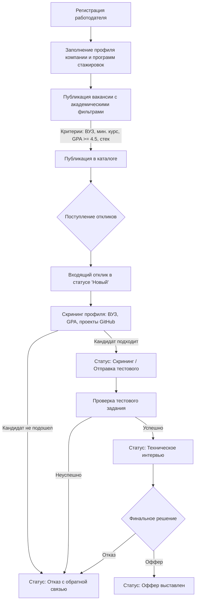
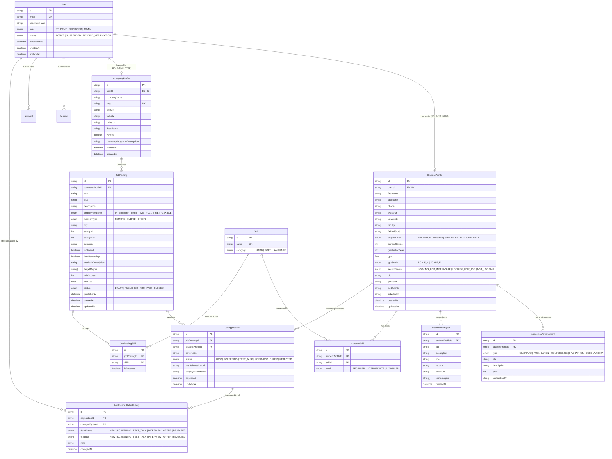

# Контекст проекта и доменная модель (UniTalent)

> **Бизнес-контекст, целевые персоны, сценарии взаимодействия (User Journeys) и схема сущностей данных (ERD) для MVP платформы студенческого рекрутинга.**

---

## 1. Бизнес-контекст и проблематика

### Проблема рынка
Классические платформы рекрутинга (HeadHunter, SuperJob, LinkedIn) создавались для устоявшегося рынка труда:
1. **Дискриминация по опыту:** 90%+ вакансий содержат фильтр «опыт работы от 1 года». У талантливых студентов старших курсов нет коммерческого стажа, из-за чего их отклики автоматически отсеиваются алгоритмами или первичным скринингом HR.
2. **Игнорирование академических сигналов:** стандартные формы резюме скрывают реальные достижения студента: высокий GPA (средний балл), победы во всероссийских олимпиадах, курсовые/дипломные проекты с продакшн-стеком, участие в конференциях и научные публикации.
3. **Высокая стоимость найма джуниоров для бизнеса:** компании тратят сотни часов на ручной просмотр резюме без релевантных маркеров, получая шквал неквалифицированных откликов («свитчеров» после быстрых курсов) вместо профильных студентов с фундаментальной базой.

### Решение UniTalent
Платформа **UniTalent** позиционируется как специализированная экосистема раннего карьерного старта:
* **Для студентов:** возможность представить свой академический капитал (ВУЗ, средний балл, проекты на GitHub, хакатоны, публикации) как полноценный эквивалент коммерческого опыта.
* **Для компаний:** инструмент таргетированного поиска молодых талантов с фильтрацией по конкретным ВУЗам, кафедрам, курсам, минимальному среднему баллу (GPA) и специализированным навыкам.

---

## 2. Пользовательские персоны (User Personas)

### Персона 1: Алексей (Студент-выпускник)
* **Возраст:** 21 год.
* **Статус:** 3-й курс бакалавриата (ФКН ВШЭ / МГТУ им. Баумана, «Программная инженерия»).
* **Академический профиль:** GPA 4.8 / 5.0, призер олимпиады «Я — профессионал», курсовой проект — распределенный кеш на Go/Rust с открытым кодом на GitHub.
* **Цель:** Найти гибкую стажировку (20–30 часов в неделю) или part-time позицию в сильной инженерной команде с возможностью совмещения с сессией и наличием ментора.
* **Боли:** Традиционные рекрутеры на HH отказывают из-за графы «Опыт: нет», не открывая ссылки на GitHub и код курсовых работ.

### Персона 2: Екатерина (Tech Lead / Hiring Manager в ИТ-компании)
* **Возраст:** 32 года.
* **Роль:** Руководитель группы бэкенд-разработки в финтехе.
* **Цель:** Набрать 3–4 стажеров на оплачиваемую летне-осеннюю программу с перспективой перевода в штат на Junior+.
* **Критерии отбора:** Сильная фундаментальная база (алгоритмы, дискретная математика, базы данных), профильные направления ведущих технических ВУЗов, GPA не ниже 4.2, наличие учебных проектов с чистым кодом.
* **Боли:** Огромный поток нерелевантных откликов на общих сайтах; невозможность отфильтровать кандидатов по ВУЗу и академической успеваемости.

### Персона 3: Дмитрий (HR / Talent Acquisition Specialist)
* **Возраст:** 27 лет.
* **Роль:** Ведущий специалист по работе со студенческими программами в крупной EdTech-компании.
* **Цель:** Организовать прозрачную воронку отбора кандидатов на стажировки, оперативно передавать тестовые задания и согласовывать интервью с тимлидами.
* **Боли:** Необходимость вести кандидатов в разрозненных таблицах Excel/Notion, отсутствие прозрачного статуса рассмотрения и стандартизированных академических анкет.

### Персона 4: Администратор платформы
* **Роль:** Обеспечение качества и безопасности каталога.
* **Цель:** Верификация профилей компаний-работодателей, модерация вакансий на соответствие условиям стажировок (проверка наличия стипендии, запрет недобросовестных неоплачиваемых переработок), актуализация справочников ВУЗов.

---

## 3. Пользовательские сценарии (User Journeys)

### Сценарий 1: Студент — от регистрации до оффера

### Сценарий 2: Работодатель — публикация вакансии и отбор кандидатов

---

## 4. Схема сущностей данных (Entity Relationship Diagram — ERD)

---

## 5. Ролевая модель и матрица доступа (RBAC)

| Ресурс / Действие | Гость | Студент (`STUDENT`) | Работодатель (`EMPLOYER`) | Администратор (`ADMIN`) |
| :--- | :---: | :---: | :---: | :---: |
| Просмотр каталога вакансий | ✅ | ✅ | ✅ | ✅ |
| Поиск и фильтрация по GPA / ВУЗам | ❌ (превью) | ✅ | ✅ | ✅ |
| Просмотр профиля компании | ✅ | ✅ | ✅ | ✅ |
| Создание / редактирование своего резюме | ❌ | ✅ (только свое) | ❌ | ✅ (модерация) |
| Отклик на вакансию | ❌ | ✅ | ❌ | ❌ |
| Создание и редактирование вакансий | ❌ | ❌ | ✅ (только своей компании) | ✅ |
| Просмотр откликов на вакансию | ❌ | ❌ | ✅ (на свои вакансии) | ✅ |
| Смена статуса отклика (Kanban) | ❌ | ❌ | ✅ | ✅ |
| Верификация компании / модерация | ❌ | ❌ | ❌ | ✅ |

---

## 6. Ключевые продуктовые метрики (KPI)

1. **Конверсия студента в отклик (CR):** доля зарегистрированных студентов с заполненным профилем (ВУЗ, GPA, >= 1 проект), отправивших минимум 1 отклик.
2. **Time-to-First-Response:** среднее время отклика работодателя на академическую анкету студента (целевой показатель < 72 часов).
3. **Релевантность кандидатов:** процент кандидатов, переведенных со стадии `Новый` на стадию `Тестовое`/`Интервью` (цель > 35% благодаря фильтрации по ВУЗу и GPA).
4. **Завершенность профиля (Profile Completeness Score):** процент студентов с заполненным GPA, подтвержденными проектами и списком хард-скиллов.
